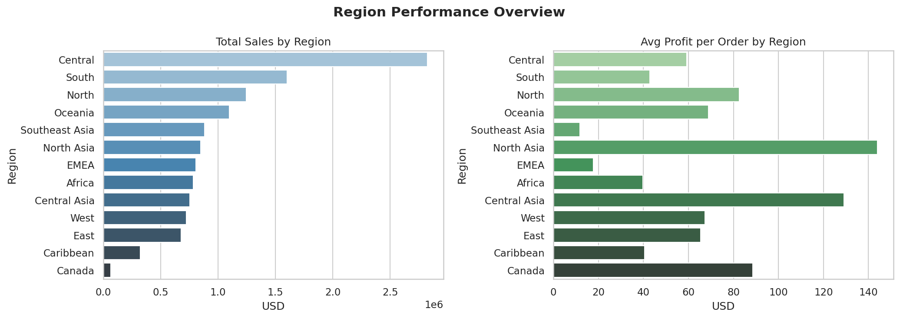
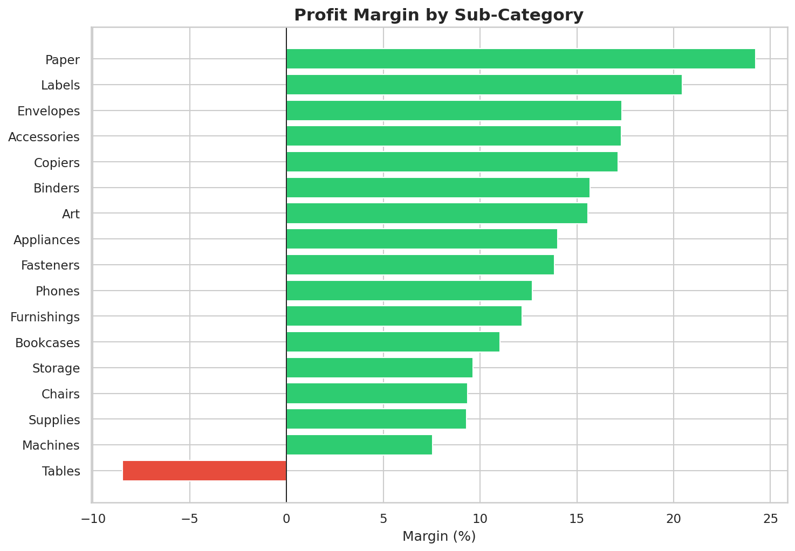
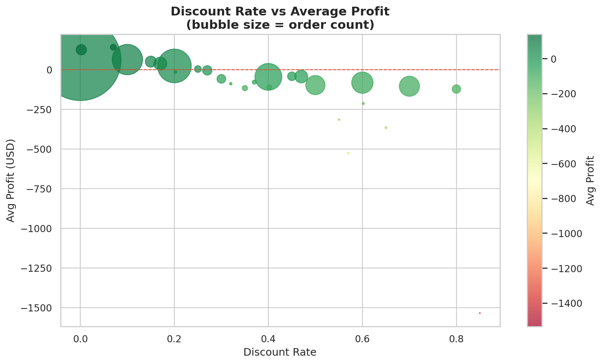
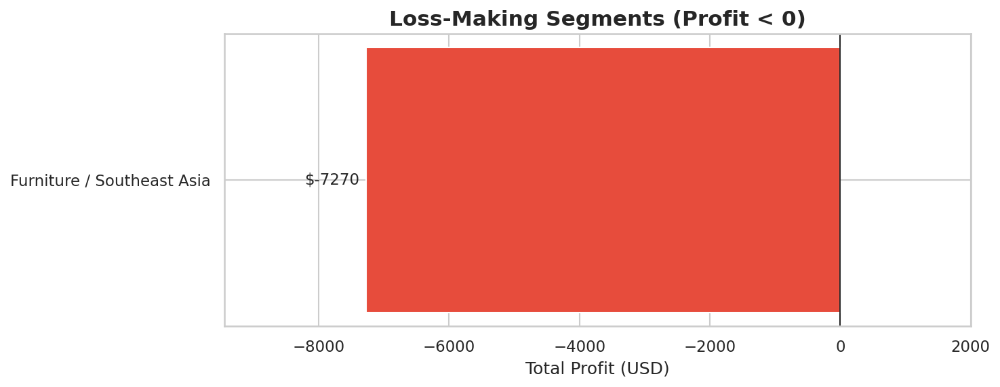

# 🛒 Superstore Sales ETL Pipeline


---

## 📌 Project Overview

This project demonstrates an end-to-end data engineering and analytics pipeline built on retail sales data. The workflow covers four layers: extracting raw data from a CSV source, performing data cleaning and feature engineering with Python (Pandas/NumPy), running structured business intelligence queries in MySQL, and generating automated visual reports with Seaborn/Matplotlib — all with production-grade security, logging, and error handling.

---

## 🏗️ Architecture

```
CSV Source
    ↓
ETL (data_pipeline.py)         — Extraction, Validation, Transformation, Loading
    ↓
MySQL Data Warehouse            — superstore_orders + sales_summary tables
    ↓
SQL (business_queries.sql)     — 9 business intelligence queries
    ↓
BI / Python (analytics_viz.py) — 9 automated visual reports
```

---

## 🛠️ Tech Stack

| Tool | Purpose |
|---|---|
| **Python 3.x** | Core scripting language |
| **Pandas & NumPy** | Data manipulation, validation, and vectorized numerical operations |
| **MySQL** | Relational database — data warehouse layer |
| **SQLAlchemy & PyMySQL** | Database engine abstraction and connectivity |
| **Seaborn & Matplotlib** | Business analytics visualizations |
| **python-dotenv** | Secure environment variable management |
| **VS Code / Jupyter Notebook** | Development environment |

---

## 🔄 The ETL Process (`data_pipeline.py`)

### 1. Extraction

The raw dataset (51,290 rows) is loaded via `pandas`. The source file path is configurable through the `DATA_FILE` environment variable, defaulting to the local CSV if not set.

```python
data_file = os.getenv("DATA_FILE", "superstore_son_versiyon.csv")
df = pd.read_csv(data_file, encoding='utf-8')
```

**Statistical summary (selected columns):**

| | Sales ($) | Profit ($) | Quantity | Discount |
|---|---|---|---|---|
| count | 51,290 | 51,290 | 51,290 | 51,290 |
| mean | 246.50 | 28.61 | 3.48 | 0.14 |
| std | 487.57 | 174.34 | 2.28 | 0.21 |
| min | 0.00 | **-6,599.98** | 1 | 0.00 |
| 25% | 31.00 | 0.00 | 2 | 0.00 |
| median | 85.00 | 9.24 | 3 | 0.00 |
| 75% | 251.00 | 36.81 | 5 | 0.20 |
| max | 22,638.00 | 8,399.98 | 14 | 0.85 |

> **Note:** The 25th percentile of Profit is $0.00, meaning at least 25% of all transactions generate no profit. Combined with a minimum of -$6,599.98, this signals a structurally significant discounting problem across the dataset.

---

### 2. Validation (Data Quality Gate)

Three-stage validation is enforced before any transformation:

- **Duplicate Handling:** Detects and drops duplicate transactions to prevent inflated revenue figures. Logged with exact count.
- **Null Value Checks:** Scans `Sales` and `Profit` columns — rows with missing values in these critical fields are dropped and logged.
- **Schema Validation:** Verifies that all required business columns (`Sales`, `Profit`, `Quantity`, `Discount`) exist before processing. Raises a `ValueError` with a clear message if the source schema changes.

---

### 3. Transformation & Feature Engineering

```python
# Column standardization: Order.ID → Order_ID
df.columns = [col.replace('.', '_') for col in df.columns]

# Date type correction
df['Order_Date'] = pd.to_datetime(df['Order_Date'], errors='coerce')
df['Ship_Date']  = pd.to_datetime(df['Ship_Date'],  errors='coerce')

# Safe margin calculation (Division by Zero protection)
df['Profit_Margin'] = np.where(
    df['Sales'] == 0,
    0,
    (df['Profit'] / df['Sales']) * 100
)
```

An aggregated summary table is also generated at this stage:

```python
agg_df = df.groupby(["Category", "Region"])[["Sales", "Profit"]].sum().reset_index()
agg_df['Profit_Margin'] = np.where(agg_df['Sales'] == 0, 0,
                                    (agg_df['Profit'] / agg_df['Sales']) * 100)
```

**Sales & Profit by Category and Region (selected):**

| Category | Region | Sales ($) | Profit ($) |
|---|---|---|---|
| Technology | Central | 1,038,515 | 135,538 |
| Office Supplies | Central | 923,471 | 121,315 |
| Technology | North | 495,802 | 99,272 |
| Office Supplies | South | 515,208 | 67,496 |
| Furniture | East | 208,291 | 3,046 |
| **Furniture** | **Southeast Asia** | **313,391** | **-7,270** ⚠️ |

> ⚠️ **Key Finding:** Furniture in Southeast Asia generates $313K in revenue but a net loss of -$7,270. High gross sales masking structural losses is a direct signal for pricing policy review and regional strategy reassessment.

---

### 4. Loading & Security

- **Dual Table Strategy:** Raw transaction data loads into `superstore_orders`; the pre-aggregated summary loads into `sales_summary` — enabling both granular and fast analytical queries.
- **Credential Security:** All database credentials are managed via environment variables. A missing `DB_PASSWORD` raises an `EnvironmentError` immediately — the pipeline never attempts a passwordless connection.
- **Idempotency:** `if_exists='replace'` ensures the pipeline is safe to re-run without duplicating records.
- **Fail-Safe Design:** All exceptions are caught, logged with full detail, and trigger `sys.exit(1)` — enabling clean integration with CI/CD pipelines and schedulers.
- **Structured Logging:** All pipeline events (row counts, warnings, errors) are written simultaneously to terminal and `etl_pipeline.log` for auditability.

```python
# Fail-safe credential check
if not db_password:
    raise EnvironmentError("CRITICAL: 'DB_PASSWORD' environment variable is missing.")

# Dual table load
df.to_sql('superstore_orders', con=engine, if_exists='replace', index=False)
agg_df.to_sql('sales_summary',  con=engine, if_exists='replace', index=False)
```

---

## 🔍 Business Intelligence Layer (`business_queries.sql`)

9 SQL queries organized by analytical category, running directly against the MySQL data warehouse:

| # | Query | Technique |
|---|---|---|
| 1 | Executive Summary — Total Sales / Profit / Margin | Aggregation, `NULLIF` |
| 2 | Monthly Sales & Profit Trend | `DATE_FORMAT`, `GROUP BY` |
| 3 | Year-over-Year Growth | CTE, `LAG()` window function |
| 4 | Pareto — Top customers (~80% of sales) | Nested subquery, `SUM() OVER()` |
| 5 | Segment Analysis — Significant segments (>100K) | `GROUP BY`, `HAVING` |
| 6 | Region Performance — Sales & avg profit per order | `COUNT(DISTINCT)`, derived KPI |
| 7 | Sub-Category Margin — Negative margin detection | `HAVING` with expression |
| 8 | Discount Impact — Profit erosion analysis | `GROUP BY Discount`, `AVG()` |
| 9 | Loss-Making Segments — Critical risk detection | `HAVING SUM(Profit) < 0` |

---

## 📊 Business Analytics Dashboard (`analytics_viz.py`)

Each SQL query is paired with a dedicated visualization. All charts are auto-generated from the MySQL data warehouse and saved to `/images`.

### 1. Executive Summary
Total Sales, Profit, and Profit Margin as KPI cards.


---

### 2. Monthly Sales & Profit Trend
Monthly trajectory of business performance across the full dataset period.


---

### 3. Year-over-Year Growth
Annual sales volume with YoY growth rate overlay on dual axis.


---

### 4. Pareto Analysis — Top Customers
Top 20 customers by revenue with cumulative % line — identifying the ~20% driving the majority of sales.


---

### 5. Profitability Heatmap — Category × Region
Color-coded profit matrix (RdYlGn) revealing structurally loss-making segment/region combinations.


---

### 6. Region Performance
Total sales and average profit per order by region — side-by-side comparison.



---

### 7. Sub-Category Profit Margin
Diverging bar chart — negative-margin sub-categories highlighted in red.



---

### 8. Discount Impact on Profit
Bubble scatter showing how increasing discount rates erode average profit per order.



---

### 9. Loss-Making Segments
Critical risk detection — Category/Region combinations where total profit is negative despite positive revenue.



---

## 💡 Business Relevance

This project reflects an analytical approach informed by economics and econometric training — moving beyond technical data handling to identify commercially significant patterns — moving beyond technical data handling to identify commercially significant patterns:

- **Enterprise-Grade Security & Reliability:** Credential management via environment variables, schema validation gates, and `sys.exit(1)` on failure — production-ready by design.
- **Margin erosion risk:** At least 25% of transactions yield zero profit; Southeast Asia Furniture operates at a net loss despite $313K revenue — directly relevant to financial control and audit processes.
- **Discount-profit correlation:** Discount rates above 40% consistently produce negative average profit per order — a structural pricing policy issue visible in both SQL (Query 8) and the scatter visualization.
- **Regional performance variance:** Profitability diverges sharply across markets, supporting data-driven resource allocation decisions.
- **Data integrity enforcement:** Type correction, null dropping, and naming standardization are prerequisites for reliable regulatory reporting.

---

## 📂 Repository Structure

```
├── src/
│   ├── data_pipeline.py      # ETL pipeline — Extraction, Validation, Transformation, Loading
│   └── analytics_viz.py      # Business analytics & visualization (9 charts)
├── sql/
│   └── business_queries.sql  # 9 business intelligence SQL queries
├── images/                   # Auto-generated visualization outputs
│   ├── 01_executive_summary.png
│   ├── 02_monthly_trend.png
│   ├── 03_yoy_growth.png
│   ├── 04_pareto_analysis.png
│   ├── 05_segment_heatmap.png
│   ├── 06_region_performance.png
│   ├── 07_subcategory_margin.png
│   ├── 08_discount_impact.png
│   └── 09_loss_segments.png
├── data/
│   └── superstore_data.csv   # Raw dataset (not uploaded due to size)
├── .env.example              # Template: DB_USER, DB_PASSWORD, DB_HOST, DB_PORT, DB_NAME, DATA_FILE
├── .gitignore                # Excludes .env, /data, etl_pipeline.log
├── LICENSE
├── README.md
└── requirements.txt
```

---

## 🚀 How to Run

```bash
# 1. Install dependencies
pip install -r requirements.txt

# 2. Configure environment variables
cp .env.example .env
# Edit .env with your MySQL credentials

# 3. Run the ETL pipeline
python src/data_pipeline.py
# ✅ Loads data into MySQL (superstore_orders + sales_summary tables)
# ✅ Writes execution log to etl_pipeline.log

# 4. Generate business analytics visuals
python src/analytics_viz.py
# ✅ All 9 charts saved to /images
```

---

## 🛠️ Future Roadmap (v2.0)

- **Incremental Loading:** `MAX(Order_Date)` logic to fetch only new records on each run.
- **Advanced Constraints:** `assert` checks and schema enforcement via Pydantic.
- **Database Indexing:** Query optimization on `Customer_Name` and `Order_Date` columns.
- **Orchestration:** Apache Airflow DAG for scheduled pipeline execution.

---

*Dataset: Adapted from the Tableau Superstore dataset, widely used in business analytics education.*
